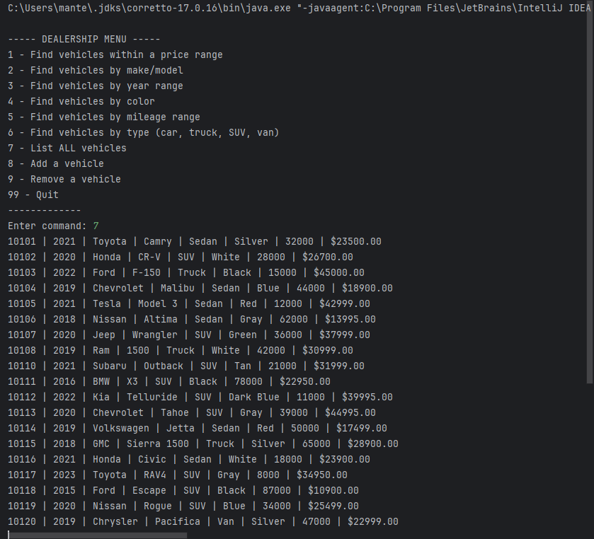

# Project Title

## Description of the Project

I made a car dealership application in Java. It lets users view and manage car inventory easily. I added features to add, remove, and search for cars. I also made the program interactive with a user-friendly interface. This project helped me practice object-oriented programming and file handling.

## User Stories

List the user stories that guided the development of your application. Format these stories as: "As a [type of user], I want [some goal] so that [some reason]."

- As a user, I want to view all cars in the inventory so that I can see what is available for purchase.
- As a user, I want to search for a car by make, model, or year so that I can find the exact car I’m looking for.
- As a user, I want to add a new car to the inventory so that I can keep the list up-to-date.
- As a user, I want to remove a car from the inventory so that sold or unavailable cars are no longer listed.
- As a user, I want the program to save and load the inventory from a file so that my changes are not lost when I close the application.
## Setup

Instructions on how to set up and run the project using IntelliJ IDEA.

### Prerequisites

- IntelliJ IDEA: Ensure you have IntelliJ IDEA installed, which you can download from [here](https://www.jetbrains.com/idea/download/).
- Java SDK: Make sure Java SDK is installed and configured in IntelliJ.

### Running the Application in IntelliJ

Follow these steps to get your application running within IntelliJ IDEA:

1. Open IntelliJ IDEA.
2. Select "Open" and navigate to the directory where you cloned or downloaded the project.
3. After the project opens, wait for IntelliJ to index the files and set up the project.
4. Find the main class with the `public static void main(String[] args)` method.
5. Right-click on the file and select 'Run 'YourMainClassName.main()'' to start the application.

## Technologies Used

- Java: Mention the version you are using.
- Any additional libraries or frameworks used in the project.

## Demo

Include screenshots or GIFs that show your application in action. Use tools like [Giphy Capture](https://giphy.com/apps/giphycapture) to record a GIF of your application.

## Future Work

Outline potential future enhancements or functionalities you might consider adding:

- Additional feature to be developed.
- Improvement of current functionalities.

## Resources

List resources such as tutorials, articles, or documentation that helped you during the project.

- [Java Programming Tutorial](https://www.example.com)
- [Effective Java](https://www.example.com)

## Team Members

- **Name 1** - Specific contributions or roles.
- **Name 2** - Specific contributions or roles.

## Thanks

Express gratitude towards those who provided help, guidance, or resources:

- Thank you to [Mentor's Name] for continuous support and guidance.
- A special thanks to all teammates for their dedication and teamwork.
